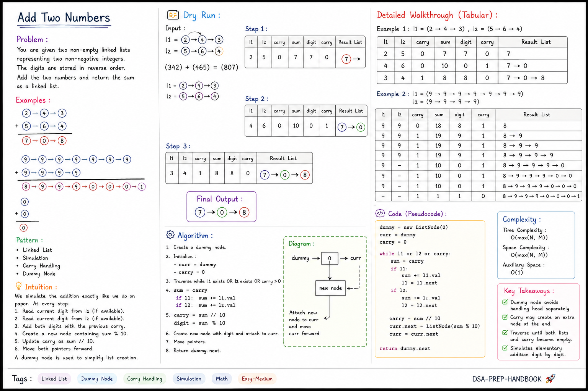

# ➕ Add Two Numbers

## 📌 Problem

You are given two non-empty linked lists representing two non-negative integers.

- The digits are stored in **reverse order**.
- Each node contains a single digit.
- Add the two numbers and return the sum as a linked list.

---

## 🎯 Pattern

- Linked List
- Simulation
- Carry Handling
- Dummy Node

---

## 💡 Intuition

Instead of converting the linked lists into integers, we simulate the addition exactly like we do on paper.

At every step:

1. Read current digit from `l1` (if available).
2. Read current digit from `l2` (if available).
3. Add both digits with the previous carry.
4. Create a new node containing `sum % 10`.
5. Update carry as `sum // 10`.
6. Move both pointers forward.

A **dummy node** is used to simplify list creation.

---

---

# 🖼 Dry Run




---


## 📝 Algorithm

1. Create a dummy node.
2. Initialize:
   - `curr = dummy`
   - `carry = 0`
3. Traverse while:
   - `l1` exists
   - OR `l2` exists
   - OR `carry > 0`
4. Compute:

```text
sum = carry

if l1:
    sum += l1.val

if l2:
    sum += l2.val
```

5. Update

```text
carry = sum // 10
digit = sum % 10
```

6. Create new node using `digit`.
7. Move pointers.
8. Return `dummy.next`.

---

# 🧠 Dry Run

### Input

```
l1 = [2,4,3]
l2 = [5,6,4]
```

Represents

```
342
+
465
----
807
```

---

### Iteration 1

```
2 + 5 + carry(0)

sum = 7

digit = 7

carry = 0

Answer

7
```

---

### Iteration 2

```
4 + 6 + carry(0)

sum = 10

digit = 0

carry = 1

Answer

7 → 0
```

---

### Iteration 3

```
3 + 4 + carry(1)

sum = 8

digit = 8

carry = 0

Answer

7 → 0 → 8
```

---

### Final Output

```
7 → 0 → 8
```

---

## 📊 Complexity

| Complexity | Value |
|------------|-------|
| Time | **O(max(N, M))** |
| Space | **O(max(N, M))** *(Output list only)* |
| Auxiliary Space | **O(1)** |

---

## 🔑 Key Takeaways

✅ Dummy node avoids handling the head separately.

✅ Carry may create an extra node at the end.

✅ Traverse until **both lists and carry** become empty.

✅ Simulates elementary addition digit by digit.

---

# 💻 Python Solution

```python
# Definition for singly-linked list.
# class ListNode(object):
#     def __init__(self, val=0, next=None):
#         self.val = val
#         self.next = next
class Solution(object):
    def addTwoNumbers(self, l1, l2):
        dummy = ListNode(0)
        curr = dummy
        carry = 0

        while l1 or l2 or carry:
            sum = carry
            if l1:
                sum += l1.val
                l1 = l1.next
            if l2:
                sum += l2.val
                l2 = l2.next
            carry = sum // 10
            curr.next = ListNode(sum % 10)
            curr = curr.next

        return dummy.next

```

---

## 📚 Learning Outcomes

After solving this problem, you will understand:

- ✅ How to simulate elementary addition using a linked list.
- ✅ How to use a **Dummy (Sentinel) Node** to simplify linked list construction.
- ✅ How to maintain and propagate **carry** across iterations.
- ✅ How to traverse two linked lists simultaneously using pointers.
- ✅ How to handle lists of different lengths without extra preprocessing.
- ✅ How to deal with the final carry by creating an additional node when required.
- ✅ How to build a new linked list dynamically during traversal.
- ✅ How to write clean and interview-friendly linked list code.


---

**Pattern:** Linked List • Dummy Node • Carry Handling • Simulation