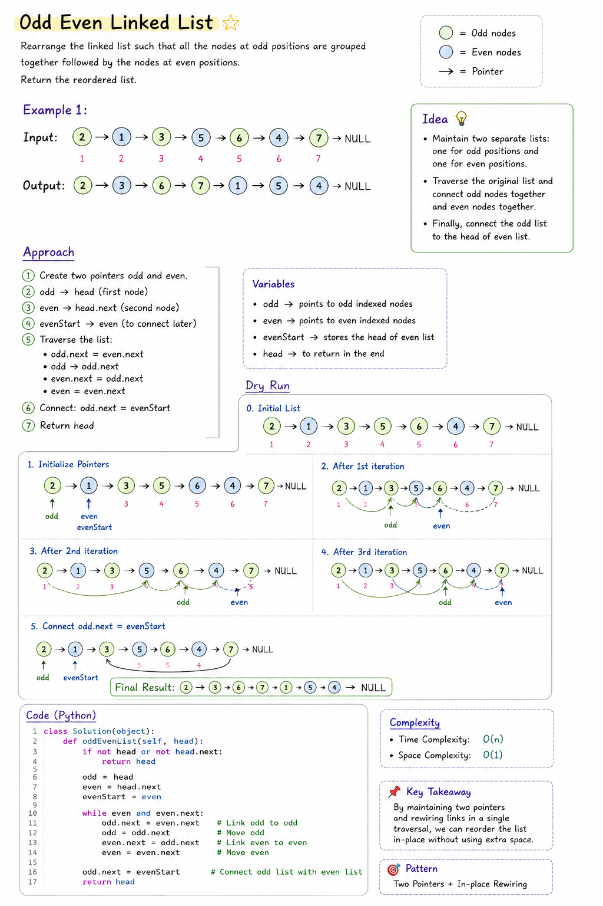

# Odd Even Linked List

## 📝 Problem

Given the head of a singly linked list, group all nodes at odd indices together followed by the nodes at even indices.

> **Note:** The node values remain unchanged. Only the links between nodes are rearranged.

---

# 🎯 Pattern

- Linked List
- Two Pointers
- In-place Pointer Manipulation

---

# 💡 Intuition

Instead of creating a new linked list, maintain two separate chains:

- One for **odd-indexed nodes**
- One for **even-indexed nodes**

Store the head of the even list so it can be attached after the odd list is complete.

This allows the list to be rearranged in-place using **O(1)** extra space.

---

# 🖼 Dry Run




---

# ⚡ Algorithm

1. Handle edge cases (empty list or single node).
2. Initialize:
   - `odd = head`
   - `even = head.next`
   - `evenStart = even`
3. While both `even` and `even.next` exist:
   - Connect odd nodes together.
   - Connect even nodes together.
   - Move both pointers forward.
4. Attach the even list after the odd list.
5. Return the original head.

---

# 📊 Complexity Analysis

| Complexity | Value |
|------------|-------|
| Time | **O(n)** |
| Space | **O(1)** |

---

# 🧠 Key Takeaways

- Learned how to manipulate pointers without creating extra nodes.
- Understood how two pointers can maintain two independent linked lists.
- Practiced in-place linked list modification.
- Reinforced the importance of handling edge cases before pointer operations.

---

# 💻 Python Solution

```python
# Definition for singly-linked list.
# class ListNode(object):
#     def __init__(self, val=0, next=None):
#         self.val = val
#         self.next = next
class Solution(object):
    def oddEvenList(self, head):
        """
        :type head: Optional[ListNode]
        :rtype: Optional[ListNode]
        """
        if not head or not head.next:
            return head

        odd = head
        even = head.next
        evenStart = even

        while odd.next and even.next:
            odd.next = odd.next.next
            even.next = even.next.next
            odd = odd.next
            even = even.next
        odd.next = evenStart
        return head
        
```

---

# 📝 Pattern Recognition

Whenever a linked list problem asks you to:

- Rearrange nodes
- Preserve the original nodes
- Avoid extra memory

Think about:

- ✅ Two Pointers
- ✅ In-place Pointer Manipulation
- ✅ Link Rewiring

---

## 🚀 Learning Outcome

This problem strengthened my understanding of pointer movement and in-place linked list manipulation. Instead of focusing only on coding, I practiced visualizing every pointer update through dry runs, making the solution much easier to understand and debug.